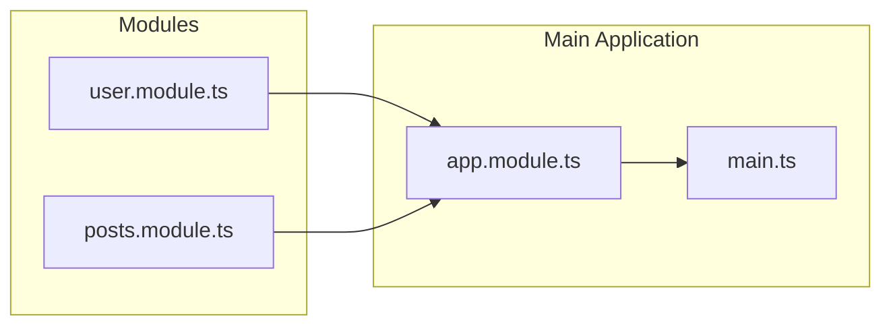
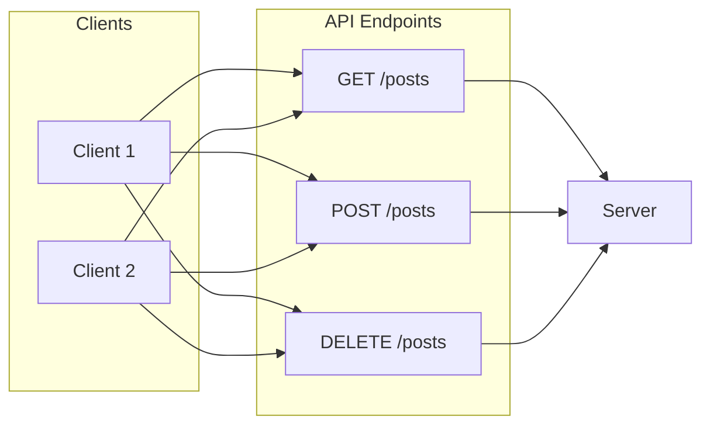
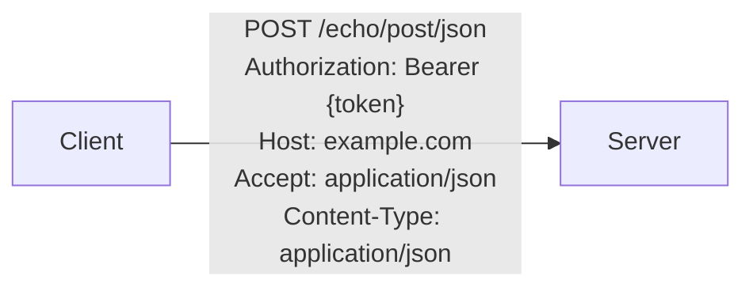
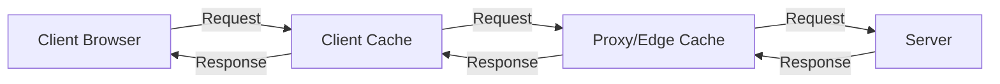
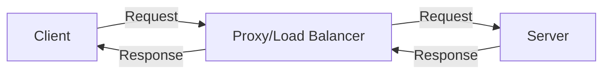

# NestJS Masterclass

This repository contains the code examples, exercises, and projects for the NestJS Masterclass.

## What is NestJS?

NestJS is a progressive Node.js framework for building efficient, reliable, and scalable server-side applications. It uses TypeScript by default and is heavily inspired by Angular, making it a great choice for developers familiar with Angular's architecture.

### Why NestJS?

If we have Node.js, why do we need NestJS? Node.js is a runtime environment that allows us to run JavaScript on the server side. However, it does not provide a structured way to build applications. NestJS fills this gap by providing a framework that encourages best practices, modular architecture, and dependency injection.

NestJS allows for scalable application development by providing features like:

- **Modularity**: Organize your code into modules for better maintainability.
- **Dependency Injection**: Manage dependencies in a clean and efficient way.
- **TypeScript Support**: Leverage TypeScript's features for better code quality and developer experience.
- **Extensive Ecosystem**: Use a wide range of libraries and tools that integrate seamlessly with NestJS.

### Why do we need structured code?

Structured code is essential for several reasons:

- **Maintainability**: Well-structured code is easier to read, understand, and modify. It reduces complexity and makes it easier to onboard new developers.
- **Scalability**: As applications grow, structured code helps manage complexity and allows for easier scaling. It enables teams to work on different parts of the application without stepping on each other's toes
- **Testability**: Structured code is easier to test. It allows for better isolation of components, making unit testing and integration testing more straightforward.
- **Consistency**: A consistent code structure helps developers follow best practices and reduces the likelihood of bugs. It also makes it easier to enforce coding standards across the team.

### How does NestJS make this possible?

NestJS provides a modular architecture that encourages developers to organize their code into modules, controllers, and services. This structure promotes separation of concerns, making it easier to manage dependencies and maintain the codebase.

NestJS provides out-of-the-box features like routing, middleware, exception handling, testing, documentation, plugins, and more.

### Use Cases for NestJS

NestJS is suitable for a wide range of applications, including:

- **RESTful APIs**: Build robust and scalable APIs for web and mobile applications.
- **GraphQL APIs**: Create flexible and efficient APIs using GraphQL.
- **Microservices**: Develop distributed systems with ease, leveraging NestJS's built-in support for microservices architecture.
- **Real-time Applications**: Build real-time applications using WebSockets and other real-time protocols.
- **Serverless Applications**: Deploy NestJS applications on serverless platforms
- **Enterprise Applications**: Develop large-scale applications with complex business logic and requirements.
- **CLI Tools**: Create command-line tools and utilities using NestJS's CLI capabilities.
- **MVC Applications**: Build full-stack applications with a clear separation of concerns between the model, view, and controller layers.

## Intro to Modules

### What are Modules?

Modules in NestJS are the fundamental building blocks of an application. They allow you to organize your code into cohesive blocks of functionality. Each module encapsulates related components, such as controllers, services, and providers, making it easier to manage dependencies and maintain the codebase.

Think of modules as a package of functionality that can be reused across your application. They help you break down your application into smaller, manageable pieces, promoting separation of concerns and modularity.

Whenever you create a new feature or functionality in your application, it's a good practice to encapsulate it within a module. This way, you can easily manage and scale your application as it grows.

A module is a package that encompasses all related files to one particular entity. For example, if you have a user management feature, you can create a `UserModule` that contains all the controllers, services, and providers related to user management.

Example of a user module:

```plaintext
users.module.ts
├── users.controller.ts
├── users.service.ts
├── users.entity.ts
└── users.controller.spec.ts
```

### Default Module

In NestJS, every application has a default module called `AppModule`. This module serves as the root module of your application and is where you can import other modules, configure providers, and set up the application's main components.

NestJS comes with default `AppModule`, which is the main entry point of your application. It is automatically created when you generate a new NestJS project using the CLI.

### Files in a Module

A typical module in NestJS consists of several files that define its structure and functionality. Here are the common files you might find in a module:

- `*.module.ts`: The main module file that defines the module and imports other related modules.
- `*.controller.ts`: The controller file that handles incoming requests and returns responses (contains routing logic/API endpoints).
- `*.service.ts`: The service file that contains the business logic and interacts with the data layer (logic related to a particular functionality).
- `*.entity.ts`: The entity file that defines the data model and its properties (e.g., database schema).
- `*.controller.spec.ts`: The test file for the controller, containing unit tests to verify its behavior (contains unit tests for the controller).

### How Modules are Connected

Modules in NestJS are connected through imports and exports. When you create a module, you can import other modules to use their functionality. This allows you to build a modular architecture where each module can depend on others.

For example, if you have a `UsersModule` and a `PostsModule`, and you want to use the `UsersService` in the `PostsService`, you can import the `UsersModule` into the `PostsModule` and inject the `UsersService` where needed.

Example of Module Connection to AppModule:



## What is a REST API?

A REST API (Representational State Transfer Application Programming Interface) is a set of rules and conventions for building web services that allow different systems to communicate over HTTP. It is based on the principles of REST, which emphasizes stateless communication, resource-based interactions, and a uniform interface.

**Official Definition**: The REST API or RESTful API is an Application Programming Interface (API) that conforms to the design principles of Representational State Transfer (REST) architectural style of programming. It allows developers to access and manipulate resources using standard HTTP methods such as GET, POST, PUT, DELETE, and PATCH.

### REST Design Principles

REST APIs are designed around the following principles:

- **Statelessness**: Each request from a client to a server must contain all the information needed to understand and process the request. The server does not store any client context between requests.
- **Client-Server Decoupling**: The client and server are separate entities that can evolve independently. The client does not need to know the implementation details of the server, and vice versa.
- **Cacheability**: Responses from the server can be cached to improve performance and reduce the load on the server. This allows clients to reuse previously fetched data without making additional requests.
- **Layered System**: A REST API can be composed of multiple layers, such as load balancers, proxies, and gateways. Each layer can add functionality without affecting the overall architecture.
- **Uniform Interface**: REST APIs use a consistent and standardized way to interact with resources. This includes using standard HTTP methods (GET, POST, PUT, DELETE) and resource URIs (Uniform Resource Identifiers) to identify resources.
- **Code on Demand (optional)**: Servers can provide executable code to clients, allowing them to extend functionality without requiring a full application update. This is an optional principle and not commonly used in practice.

#### Client-Server Decoupling

Client-server decoupling is a key principle of REST APIs that allows the client and server to evolve independently. This means that changes made to the client do not require changes to the server, and vice versa. This decoupling is achieved through the use of standard protocols (like HTTP) and data formats (like JSON or XML).

In REST API design, the client and server applications must be completely independent of each other. The client should not need to know how the server is implemented, and the server should not need to know how the client is implemented. This allows for flexibility in development and deployment.

A client sends a request to the server, and the server responds with the requested data or performs the requested action. The interaction uses standard HTTP methods and status codes to communicate the outcome of the request.
The client can send HTTP methods such as GET, POST, PUT, DELETE, and PATCH to interact with the server's resources.

##### HTTP Request Methods

| Method  | Description                                                                     |
| ------- | ------------------------------------------------------------------------------- |
| GET     | Retrieve data from the server (read operation)                                  |
| POST    | Send data to the server to create a new resource (create operation)             |
| PUT     | Update an existing resource on the server (update operation)                    |
| DELETE  | Remove a resource from the server (delete operation)                            |
| PATCH   | Partially update an existing resource on the server (partial update operation)  |
| OPTIONS | Retrieve the supported HTTP methods for a resource (used for CORS preflight)    |
| HEAD    | Retrieve metadata about a resource without the response body (used for caching) |
| TRACE   | Echo back the received request (used for diagnostic purposes)                   |

#### Uniform Interface

The uniform interface is a fundamental principle of REST APIs that defines how clients and servers interact with resources. It provides a consistent and standardized way to access and manipulate resources, making it easier for developers to understand and use the API.

All API requests for the same resource should look the same or respond back the same, regardless of the client or server implementation. This means that the same HTTP methods, URIs, and data formats should be used consistently across the API.



#### Statelessness

Statelessness is a key principle of REST APIs that requires each request from a client to the server to contain all the information needed to understand and process the request. The server does not store any client context between requests, meaning that each request is independent and self-contained.

REST APIs are stateless, meaning that the server does not store any client context between requests. Each request must contain all the information needed to process it, including authentication and authorization details.



#### Cacheability

Cacheability is a principle of REST APIs that allows responses from the server to be cached by clients or intermediaries. This improves performance and reduces the load on the server by allowing clients to reuse previously fetched data without making additional requests.

When possible, resources should be cacheable both on the client side and server side. This can be achieved by using HTTP headers like `Cache-Control`, `ETag`, and `Last-Modified` to control how responses are cached and when they should be revalidated.



#### Layered System Architecture

A layered system architecture is a design principle of REST APIs that allows for the separation of concerns by organizing the application into layers. Each layer has its own responsibilities and can interact with other layers through well-defined interfaces.

This architecture allows for scalability, maintainability, and flexibility in the design of the API. It also enables the use of intermediaries, such as load balancers and caches, to improve performance and reliability.

REST APIs need to be designed so that neither the client nor the server can tell whether they are communicating directly or through an intermediary. This means that the API should be designed to work seamlessly with load balancers, proxies, and other intermediaries without affecting the functionality or performance of the API.



### Anatomy of a REST API Endpoint

A REST API endpoint is a specific URL that represents a resource or a collection of resources. It is the point of interaction between the client and the server, where the client can perform operations on the resource using standard HTTP methods.

An endpoint consists of the following components:

- **HTTP Method**: The action to be performed on the resource (e.g., GET, POST, PUT, DELETE).
- **URL/Domain**: The address of the resource, which includes the protocol (http or https), domain name, and path to the resource.
- **Route**: The specific path that identifies the resource within the API.
- **Parameters/Path Parameters**: Optional query parameters that can be included in the URL to filter or modify the request.
- **Query String**: A string of key-value pairs appended to the URL, used to pass additional information to the server.
- **Request Body**: The data sent in the request, typically used with POST and PUT methods to create or update resources.

```plaintext
GET https://api.example.com/users?sort=asc&limit=10
```

#### Params vs Query

In REST APIs, parameters can be passed in two main ways: as path parameters and as query parameters.

- **Path Parameters**: These are part of the URL path and are used to identify a specific resource. They are typically used to specify the resource ID or other unique identifiers.

  Example: `GET /users/{userId}` where `{userId}` is a path parameter.

- **Query Parameters**: These are appended to the URL and are used to filter or modify the request. They are typically used for pagination, sorting, and searching.

  Example: `GET /users?sort=asc&limit=10` where `sort` and `limit` are query parameters.

#### Body Object Example

The request body is used to send data to the server, typically in POST or PUT requests. It contains the data that the client wants to create or update on the server.

Example of a JSON body object for creating a new user:

```json
{
  "username": "john_doe",
  "email": "john_doe@example.com",
  "password": "password"
}
```

## Controllers

Controllers in NestJS are responsible for handling incoming requests and returning responses. They define the routes and endpoints of your application, mapping HTTP requests to specific methods that process the request and return the appropriate response.

Controllers are the routing mechanism in NestJS, allowing you to define how your application responds to different HTTP requests. They are typically decorated with the `@Controller()` decorator, which specifies the base route for the controller.

A controller receives an incoming request, processes it and decides which method should it trigger in order to process the request.

One controller file can process multiple routes, and each route can have its own method to handle the request. This allows you to group related routes together in a single controller.

```typescript
import { Controller } from '@nestjs/common'

@Controller('users')
export class UsersController {
  // Define your routes and methods here
}
```

We can also generate a controller using the NestJS CLI:

```bash
nest generate controller users
```

## Intro to Providers

Providers in NestJS are classes that encapsulate business logic and can be injected into controllers or other providers. They are the backbone of the application's functionality, allowing you to define services, repositories, and other components that can be reused across your application.

Think of providers as the services that handle the business logic of your application. They are responsible for processing data, interacting with databases, and performing other operations that are not directly related to handling HTTP requests.

You can also think of providers as additional classes in a module that help you add business logic to your module. They can be used to encapsulate complex logic, interact with external APIs, or perform data transformations.

While the job of the controller is handle routing logic, the job of the provider is to handle business logic. You should not be writing business logic in your controllers, as it can lead to tightly coupled code and make it harder to maintain and test your application.
