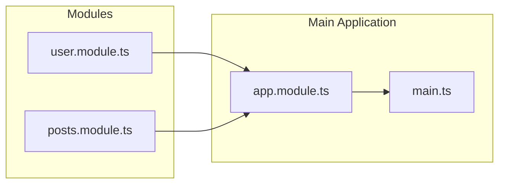

# NestJS Masterclass

This repository contains the code examples, exercises, and projects for the NestJS Masterclass.

## What is NestJS?

NestJS is a progressive Node.js framework for building efficient, reliable, and scalable server-side applications. It uses TypeScript by default and is heavily inspired by Angular, making it a great choice for developers familiar with Angular's architecture.

### Why NestJS?

If we have Node.js, why do we need NestJS? Node.js is a runtime environment that allows us to run JavaScript on the server side. However, it does not provide a structured way to build applications. NestJS fills this gap by providing a framework that encourages best practices, modular architecture, and dependency injection.

NestJS allows for scalable application development by providing features like:

- **Modularity**: Organize your code into modules for better maintainability.
- **Dependency Injection**: Manage dependencies in a clean and efficient way.
- **TypeScript Support**: Leverage TypeScript's features for better code quality and developer experience.
- **Extensive Ecosystem**: Use a wide range of libraries and tools that integrate seamlessly with NestJS.

### Why do we need structured code?

Structured code is essential for several reasons:

- **Maintainability**: Well-structured code is easier to read, understand, and modify. It reduces complexity and makes it easier to onboard new developers.
- **Scalability**: As applications grow, structured code helps manage complexity and allows for easier scaling. It enables teams to work on different parts of the application without stepping on each other's toes
- **Testability**: Structured code is easier to test. It allows for better isolation of components, making unit testing and integration testing more straightforward.
- **Consistency**: A consistent code structure helps developers follow best practices and reduces the likelihood of bugs. It also makes it easier to enforce coding standards across the team.
  cc

### How does NestJS make this possible?

NestJS provides a modular architecture that encourages developers to organize their code into modules, controllers, and services. This structure promotes separation of concerns, making it easier to manage dependencies and maintain the codebase.

NestJS provides out-of-the-box features like routing, middleware, exception handling, testing, documentation, plugins, and more.

### Use Cases for NestJS

NestJS is suitable for a wide range of applications, including:

- **RESTful APIs**: Build robust and scalable APIs for web and mobile applications.
- **GraphQL APIs**: Create flexible and efficient APIs using GraphQL.
- **Microservices**: Develop distributed systems with ease, leveraging NestJS's built-in support for microservices architecture.
- **Real-time Applications**: Build real-time applications using WebSockets and other real-time protocols.
- **Serverless Applications**: Deploy NestJS applications on serverless platforms
- **Enterprise Applications**: Develop large-scale applications with complex business logic and requirements.
- **CLI Tools**: Create command-line tools and utilities using NestJS's CLI capabilities.
- **MVC Applications**: Build full-stack applications with a clear separation of concerns between the model, view, and controller layers.

## Intro to Modules

### What are Modules?

Modules in NestJS are the fundamental building blocks of an application. They allow you to organize your code into cohesive blocks of functionality. Each module encapsulates related components, such as controllers, services, and providers, making it easier to manage dependencies and maintain the codebase.

Think of modules as a package of functionality that can be reused across your application. They help you break down your application into smaller, manageable pieces, promoting separation of concerns and modularity.

Whenever you create a new feature or functionality in your application, it's a good practice to encapsulate it within a module. This way, you can easily manage and scale your application as it grows.

A module is a package that encompasses all related files to one particular entity. For example, if you have a user management feature, you can create a `UserModule` that contains all the controllers, services, and providers related to user management.

Example of a user module:

```plaintext
users.module.ts
├── users.controller.ts
├── users.service.ts
├── users.entity.ts
└── users.controller.spec.ts
```

### Default Module

In NestJS, every application has a default module called `AppModule`. This module serves as the root module of your application and is where you can import other modules, configure providers, and set up the application's main components.

NestJS comes with default `AppModule`, which is the main entry point of your application. It is automatically created when you generate a new NestJS project using the CLI.

### Files in a Module

A typical module in NestJS consists of several files that define its structure and functionality. Here are the common files you might find in a module:

- `*.module.ts`: The main module file that defines the module and imports other related modules.
- `*.controller.ts`: The controller file that handles incoming requests and returns responses (contains routing logic/API endpoints).
- `*.service.ts`: The service file that contains the business logic and interacts with the data layer (logic related to a particular functionality).
- `*.entity.ts`: The entity file that defines the data model and its properties (e.g., database schema).
- `*.controller.spec.ts`: The test file for the controller, containing unit tests to verify its behavior (contains unit tests for the controller).

### How Modules are Connected

Modules in NestJS are connected through imports and exports. When you create a module, you can import other modules to use their functionality. This allows you to build a modular architecture where each module can depend on others.

For example, if you have a `UsersModule` and a `PostsModule`, and you want to use the `UsersService` in the `PostsService`, you can import the `UsersModule` into the `PostsModule` and inject the `UsersService` where needed.

Example of Module Connection to AppModule:


